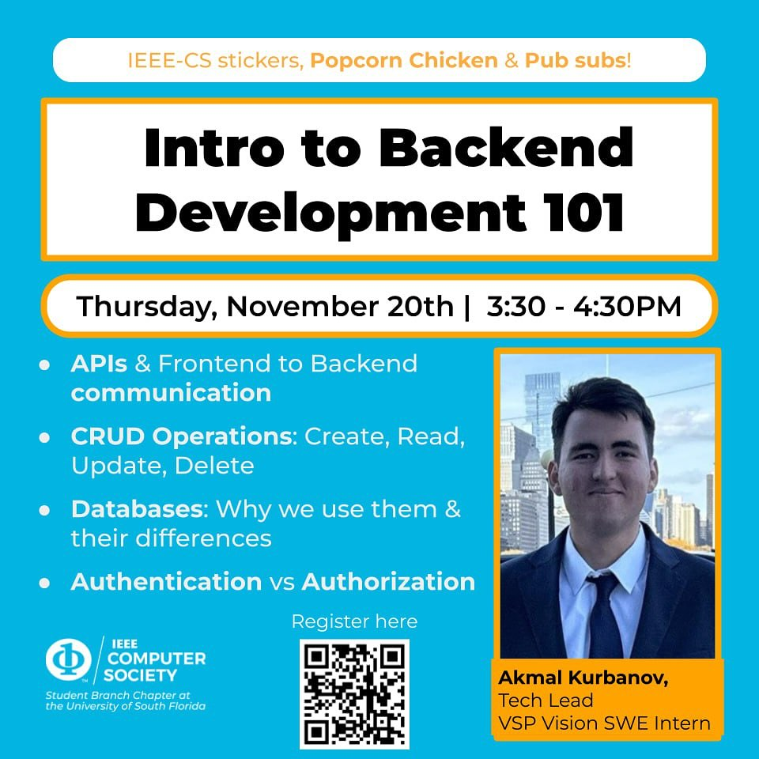

# Intro to Backend Development 101

A talk by Akmal Kurbanov, tech lead at the IEEE Computer Society student branch chapter at the University of South Florida and a software engineering intern at VSP Vision, with a year and a half of commercial backend work behind him.

Thursday, November 20, 2025, 3:30 to 4:30 PM.

## What the talk covered

- APIs, and what is actually moving between the frontend and the backend.
- CRUD, the four operations underneath every app you have used.
- Databases, why an app needs one, and how the common types differ.
- Authentication against authorization, which get mixed up constantly. One asks who you are, the other asks what you are allowed to touch.

Akmal spent more than ten hours before the session building and deploying a to-do app so the room had something real to poke at. Attendees hit its backend themselves, through the interface or through the Swagger page he set up.

Most students start on the frontend and stop there, which is exactly why backend roles stay open.

## Files

- `IEEE_CS_Backend_final;.pptx`, the slides.

## Links

- [Announcement on Instagram](https://www.instagram.com/p/DQ9Ujx7jfpH/)
- [Recap on Instagram](https://www.instagram.com/p/DRp5i9LkUT7/)
